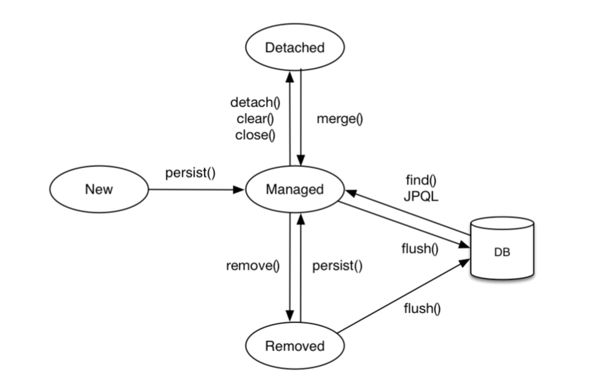

# 영속성 컨텍스트

> 엔티티를 영구 저장하는 환경(= Context)
>
> EntityManager.persis(entity);  // DB에 저장 X, 영속성 컨텍스트에 저장

영속성 컨텍스트는 논리적인 개념으로 눈에 보이지 않는다. EntityManager를 통해 영속성컨텍스트에 접근이 가능하다.

- **J2SE** 환경에서는 `EntityManager : PersistenceContext = 1 : 1` 로 볼 수 있다.

  ```
  J2SE (Standard edition)
  : 일반 자바 프로그램 개발을 위한 용도로 이용되는 개발도구
  각종 자료구조, 기본 유틸리티, AWT와 같은 GUI도구의 기본기능을 포함한다.
  ```

- J2EE, 스프링 프레임워크 같은 컨테이너 환경에서는 `N:1` 의 관계를 갖는다.

```
J2EE(Enterprise Edition)
: 엔터프라이즈 환경을 위한 도구로 EJB, JSP, Servlet.. 기능을 지원하며 웹 애플리케이션 서버를 이용하는 프로그램 개발 시 많이 사용된다.
```

---

### Entity 생명주기 (4)

- 비영속 (new/transient) : 영속성 컨텍스트와 전혀 관계가 없는 새로운 상태
  - 객체를 생성한 상태
- 영속 (managed) : 영속성 컨텍스트에 관리되는 상태
  - 객체를 EntityManager(영속 컨텍스트)에 등록한 상태
  - em.persist(member);
- 준영속(detached) : 영속성 컨텍스트에 저장되어있다가 분리된 상태
  - em.detach();
- 삭제 (removed) : 삭제된 상태
  - em.remove();




----

#### 영속성 컨텍스트 이점 (5)

1. 1차 캐시
2. 동일성 보장 (Identity)
3. 트랜잭션을 지원하는 쓰기 지연 (transactional wrte-behind) : Insert SQL 저장소
4. 변경 감지 (Dirty Checking)
5. 지연 로딩 (Lazy Loading)


##### 1. 1차 캐시

EntityManager는 1차 캐시를 가지고 있다.

데이터 조회 또는 등록하면 EntityManager에서는 key(@Id)로 value를 Entity로 가지고 있다. 트랜잭션이 끝나지 않은 경우에 해당 객체를 조회할 시 1차 캐시테이블에 존재하는 지 확인 후 없을 경우 DB 조회를 한다.  (성능적으로 이점이 되기는 힘들다. 한 트랜잭션을 기준으로하여 끝나게되면 바로 소멸하고 여러명의 유저가 같은 캐시 테이블을 바라보지 않고, 유저마다 각자 캐시테이블을 갖기 때문)

##### 2. 동일성 보장

1차 캐시로 트랜잭션 격리 수준을 Repeatable read 등급으로 맞춰준다. (애플케이션에서)

> 트랜잭션 격리 수준 (Transaction Isolation Level)
>
>  DB에서 트랜잭션들 간에 같은 동일한 데이터에 대한 동시 접근을 제한하기 위해 Lock 을 설정할 수 있다.
>
> Lock을 걸게되면 동시 처리량이 줄어들어 성능 저하가 발생할 수 있으므로 상황별로 적절한 레벨을 선택해야한다.
>
> **Dirty Read** :  다른 트랜잭션에 의해 수정되었지만 아직 커밋되지 않은 데이터를 읽는 것을 말한다. If ) 커밋되지 않은 값을 읽었는데 변경한 트랜잭션이 최종적으로 롤백하였을 경우 비일관된 상태에 놓인다.
>
> **Nonrepeatable Read** :  한 트랜잭션 내에서 같은 쿼리를 두 번 수행했는데, 그 사이에 다른 트랜잭션이 값을 수정 또는 삭제하는 바람에 두 쿼리 결과가 다르게 나타나는 현상을 말한다.
>
> **Phantom Read** : 한 트랜잭션 내에서 같은 쿼리를 두 번 수행했는데, 첫 번째 쿼리에서 없던 유령(Phantom) 레코드가 두 번째 쿼리에서 나타나는 현상을 말한다.

| ANSI/ISO SQL 표준Isolation Level | Dirty Read | Nonrepeatable Read | Phantom Read |
| :------------------------------- | :--------- | :----------------- | :----------- |
| 레벨0 <br />Read Uncommited      | 발생       | 발생               | 발생         |
| 레벨1 <br />Read Committed       | X          | 발생               | 발생         |
| 레벨2<br />Repeatable Read       | X          | X                  | 발생         |
| 레벨3 <br />Serializable         | X          | X                  | X            |


##### 3. 엔티티 등록 : 트랜잭션을 지원하는 쓰기 지원

persist 시 Entity Manager에 **쓰기 지연 SQL 저장소** 에 insert SQL을 저장한다.

트랜잭션 커밋하면 쓰기 지연 SQL 저장소에 있는 쿼리를 DB에 한번에 보낸다.

##### 4. 변경 감지 (Dirty Checking)

EntityManager에 등록 시 해당 객체를 스냅샷으로 남긴다. commit 시 스냅샷과 Entity비교하여 변경된 부분이 있다면 쓰기 지연 SQL 저장소에 update SQL 등록 한다.

----

### Flush

> 영속성 컨텍스트의 변경내용을 DB에 반영한다.
>
> 영속성 컨텍스트를 비우지 않는다. 단지, 영속성 컨텍스트의 변경된 내용(Dirty Checking)을 데이터베이스에 동기화하는 역할을 한다.

##### 플러시 발생 시 일어나는 현상

1. 변경 감지
2. 수정된 엔티티 쓰기 지연 SQL 저장소에 등록
3. 쓰기 지연 SQL 저장소의 쿼리를 데이터베이스에 전송 (등록, 수정, 삭제 쿼리)


##### 영속성 컨텍스트를 플러시하는 방법 (3)

1. em.flush : 직접 호출하는 방법
2. 트랜잭션 커밋 : 자동 호출
3. JPQL 쿼리 실행  : 자동 호출


##### 플러시 모드 옵션

`em.setFlushMode(FlushModeType.COMMIT)` 기본값은 `AUTO`이다.

FlushModeType.COMMIT은 커밋할 때만 플러시한다. 특수한 케이스를 제외하고 기본값을 사용하자.


---

### EntityManagerFactory & EntityManager

##### EntityManagerFactory

- 엔티티 매니저 팩토리는 DB별로 하나만 생성하여 애플리케이션 전체에 공유된다.

##### EntityManager

- 엔티티 매니저는 쓰레드간의 공유를 하지 않는다.

  (고객 요청이 올 때마다 EntityManager 생성하고 즉시 버린다.)

- JPA 모든 데이터 변경은 트랜잭션 안에서 실행된다.


[J2SE와 J2EE의 차이점](https://java.ihoney.pe.kr/81)

[자바 ORM 표준 JPA 프로그래밍 - 기본편](https://www.inflearn.com/course/ORM-JPA-Basic)

[트랜잭션 격리 수준](http://www.dbguide.net/db.db?cmd=view&boardUid=148216&boardConfigUid=9&boardIdx=138&boardStep=1)
