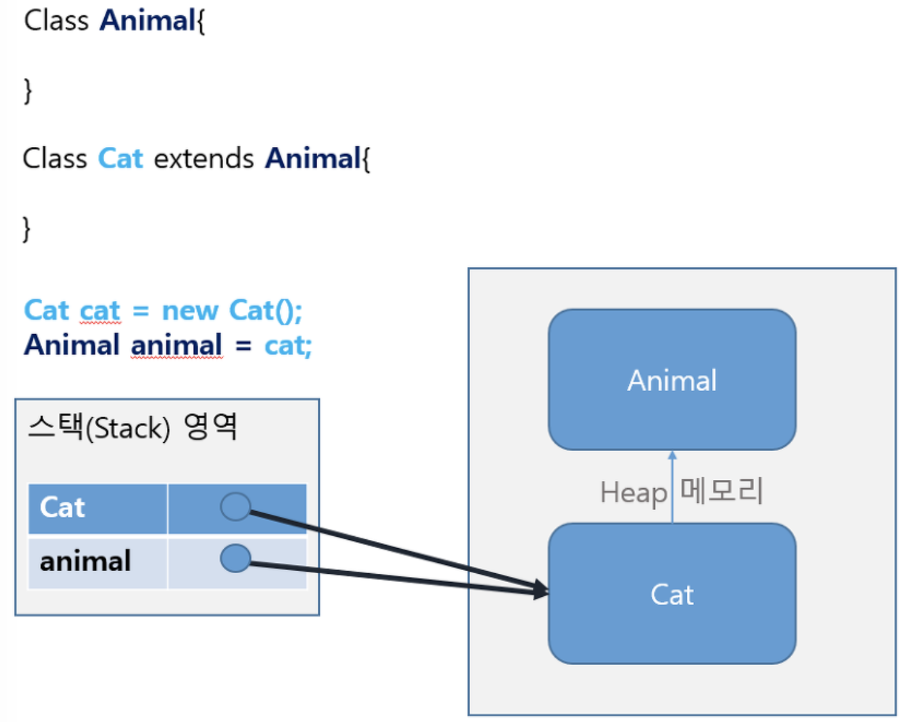

# 상속과 다형성, 추상 클래스

## 상속 (Inheritance)
1. 정의 : 부모가 자식에게 물려주는 행위       
2. 용어정리      
- 부모 클래스 = 상위 클래스
- 자식 클래스 = 하위 클래스 = 파생 클래스    
상속방법 : extends 키워드를 사용한다
``` java
class 하위클래스 extends 상위클래스{
    // 필드
    // 생성자
    // 메소드
}
```

자식 클래스는 부모 클래스를 _재사용_ 하여 클래스를 만들기 때문에 _코드 중복_ 을 줄인다.    

####__상위 클래스의 모든 메소드와 필드를 사용할 수 있는가?__
아니다.    
상위 클래스에서 `private` 필드, 메소드는 상속 대상에서 제외된다.   
또, 같은 패키지가 아닌 경우 `default` 접근 제한을 갖는 필드, 메소드도 제외된다.

####__자바는 다중 상속을 허용하지 않는다.__
클래스에 단 하나의 클래스만이 상속 가능하다.

---
#### 부모 생성자 호출   
자식 객체를 생성하면, 부모 객체가 먼저 생성된 후 자식 객체가 생성된다.   
메모리로 표현하면 아래와 같다.

모든 객체는 클래스의 생성자를 호출해야만 생성된다.
그렇기 때문에, 자식 생성자 맨 첫줄에 부모생성자를 호출한다.
```java
public Cat(){
  super();
}
//사용자 정의하고 싶은 경우
public 자식클래스(매개변수선언, ...){
  super(매개값,...);
}
```
super()는 매개값 타입,개수가 모두 일치하는 부모 생성자를 호출한다. ( 부모클래스에 일치하는 생성자가 없다면 컴파일 에러가 난다 )   
super(매개값,..)을 생략하면 자동으로 super()가 컴파일 시 추가된다.   
__super()는 자식생성자에 반드시 첫줄에 명시해야한다.__

---
### 메소드 재정의 (메소드 오버라이딩)
- 메소드 오버라이드 (@Override)
- 부모 메소드 호출 (super)
---
### final 클래스, 메소드
#### 1. final 클래스
최종적인 클래스로 상속 불가능한 클래스
즉, 자식클래스 생성불가
```java
class final class 클래스명{...}
```
예) 자바표준API String클래스

#### 2. final 메소드
최종적인 메소드로 override(재정의)가 불가능한 메소드   
```java
public final 리턴타입 메소드([매개변수..]){...}
```

---
### 타입변화와 다형성
####1. 다형성이란?
_같은 타입_ 이지만 _실행 결과가 다양한 객체_ 를 이용할 수 있는 성질을 말한다.   
__자바는 부모 클래스로 타입 변환이 가능하다.__
부모 타입에 모든 자식 객체가 대입이 가능하다는 의미이다.

####2. 타입변환
데이터 타입을 다른 데이터 타입으로 변환하는 행위를 말한다.     
자식클래스는 부모클래스를 상속받기 때문에 자동 타입 변환이 가능하다.
타입 변환을 하더라도 변경한 타입(부모클래스)를 참조하는게 아니다. 타입만 변경될 뿐 동일한(자식클래스)를 참조한다.     
__부모 타입으로 변경한 이후에는 부모타입에 해당하는 필드,메소드만 접근가능하다. (if 메소드가 overriding 되었다면 자식 클래스의 메소드가 대신 호출된다.)__
타입변환이 가능하다는 것은 다형성과 밀접한 관련이 있다.

#####<__필드의 다형성__>
다형성은 동일한 타입을 사용하지만 다양한 결과를 나타내는 성질을 의미한다.
__타입변환은 다형성을 구현하는 기술적인 방법이다.__  
보통 필드의 값을 다양화함으로써 실행결과를 다르게 나오도록 구현한다.    
_`상속과 오버라이딩, 타입변환`을 이용하면, 필드의 타입은 변화가 없지만, 실행도중 어떤 객체를 필드로 저장하냐에 따라 실행 결과를 다르게 도출할 수 있다._


#####<__매개변수의 다형성__>
자동 타입변환 발생
  - 필드의 값을 대입할 때
  - 매소드 호출할때    

메소드의 매개변수 타입이 클래스일 경우, 해당 클래스만 아니라 자식객체까지도 매개값으로 사용이 가능하다.
그리고 이 매개값으로 어떤 자식객체가 제공되느냐에 따라 메소드의 실행결과는 달라질 수 있다.(매개변수의 다형성)
자식 객체가 부모의 메소드를 재정의(오버라이딩)했다면 내부에서 오버라이딩된 메소드를 호출하기 때문에 실행결과가 다양해진다.

####3. 강제타입변환 (casting)
강제타입변환은 자식타입이 부모타입으로 변환하였을 때만 사용이 가능하다.
__부모타입의 변수가 부모 객체를 참조할 경우 자식타입으로 형변환이 불가능하다.__

####4. 객체 타입 확인  (intanceof)
객체가 부모인지, 자식객체인지 화인하는 연산자이다.    
객체가 우항타입의 인스턴스인지 확인한다.      
용도 : instanceof 연산자는 강제타입전환 필요할 경우 주로 사용하는데, 타입 확인후 안전하게 강제 타입 전환한다.      
( 잘못된 매개값을 호출 시 ClassCastException 예외 발생 할 수 있다. )    
```java
boolean result = 객체 instanceof 타입
```

---
#추상 클래스
##개념
추상(abstract)는 실체간의 공통된 특성을 추출한 것을 말한다.    
- 실체 클래스 : 객체를 직접 생성할 수 있는 클래스
- 추상 클래스 : 이 클래스들의 공통적인 특성을 추출하여 선언한 클래스
추상 클래스와 실체 클래스는 상속관계를 갖고있다.   
추상 클래스는 실체 클래스를 생성하기 위해 부모클래스로만 사용한다.

##용도
추상 클래스로 설계 규격을 만든다.
추상 클래스는 실체 클래스가 공통적으로 가질 필드, 메소드들을 정의한 클래스로 실체 클래스들을 통일화 시키기 위한 목적으로 사용한다.
1. 실체 클래스들의 공통된 필드와, 메소드의 이름을 통일시킬 수 있다.
2. 실체 클래스를 작성할 때, 시간을 절약할 수 있다.

##선언
- 키워드 : abstract
- new 연산자 이용불가
- 필드, 생성자, 메소드 사용가능 ( 생성자 선언이 가능하다? new 연산자로 생성할 수 없어도, 상속 시 super()를 호출하여 추상클래스를 생성해야함으로 반드시 필요하다. )
```java
public abstract class 클래스 {
  // 필드
  // 생성자
  // 메소드
}
```

## 추상 메소드와 overriding
모든 실체 클래스에 실행 내용이 갖다면 추상 클래스에 메소드를 작성한다.    
하지만, _실체 클래스 메소드 내용이 다르다면 선언만 통일화하고, 실체 클래스에 메소드 내용을 재정의하여 사용한다.( 추상 메소드)_    
- 추상 메소드 선언    
```java
[public | protected] abstract 리턴타입 메소드명(매개변수,,,);
// 중괄호({})가 없다.
```


상속은 중복 코드를 줄여주고 객체지향프로그래밍의 특징 중 하나인 다형성을 하는데 사용하기 좋은 도구입니다.
다형성이란 같은 타입이지만 다양한 실행 결과의 객체를 도출할 수 있습니다.
`상속과 오버라이드, 자동타입변환`을 이용하면 다형성있게 구현이 가능합니다.    
추상클래스는 상속관계를 갖고 있습니다.
실체 클래스의 공통적인 필드,메소드를 작성하여 부모클래스의 역할을 하면서 설계 규격이 되는 클래스 입니다.     
실체 클래스들의 공통된 필드, 메소드들을 공통화 시킵니다.         
